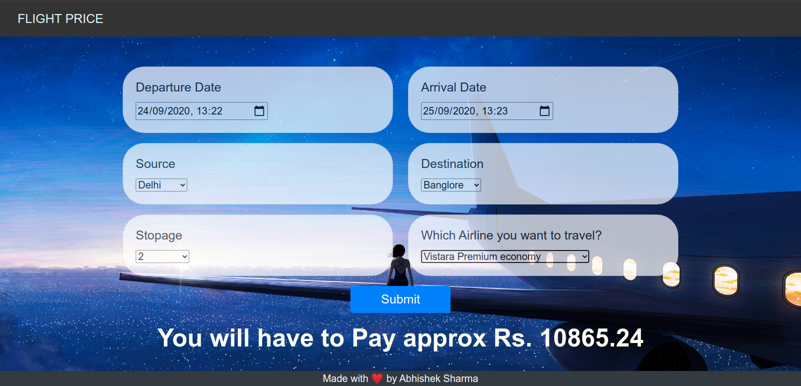

# Flight-Price-Prediction

- I did this project just for fun to hone my machine learning skill.  
- I have created a gui using HTML,Bootstrap,CSS and implemnted the backend in Flask for this project.    
- Initially I used RandomForestRegressor but that was not giving very satisfying results so I used RandomSearchCV to find best hyerparameters and came up witha a  good model with r2 score of around 0.82.  
- Also used ExtraTreeRegressor to visualize the importances of all the features.
- First open app.py in any python ide then install important packages such as flask,flask_cors, and sklearn.
- Now run app.py to see the gui on local host.  
  
  

